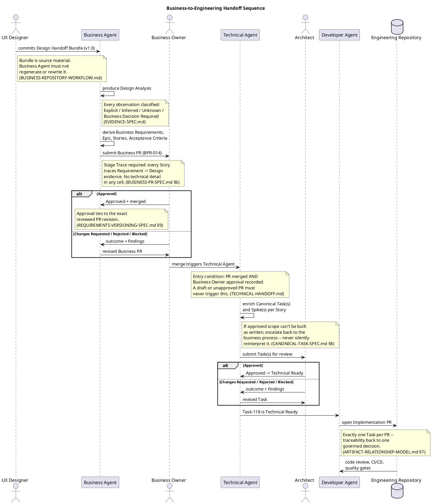

# Business-to-Engineering Handoff Sequence

## 1. Purpose

The other diagrams in this repository ([ARTIFACT-RELATIONSHIP-MODEL.md](ARTIFACT-RELATIONSHIP-MODEL.md)) show *structure* -- what artifact points to what, and how many. This document shows the same pipeline as *interaction over time*: which role does what, in what order, and what rule governs each handoff. A sequence diagram is the right shape for that, and PlantUML's note blocks let each governing rule sit directly next to the step it applies to instead of living only in prose elsewhere.

## 2. Relationship to Other Artifacts

This is a visual index into documents that already exist -- it does not redefine any rule. Each note below cites the section it restates.

- [BUSINESS-AGENT-WORKFLOW.md](BUSINESS-AGENT-WORKFLOW.md) -- the ordered steps this diagram's Business Agent lane compresses into single messages.
- [TECHNICAL-AGENT-WORKFLOW.md](TECHNICAL-AGENT-WORKFLOW.md) -- the ordered steps this diagram's Technical Agent lane compresses into single messages.
- [BUSINESS-PR-SPEC.md](BUSINESS-PR-SPEC.md) -- the Stage Trace requirement and Business Owner review outcomes.
- [TECHNICAL-HANDOFF.md](TECHNICAL-HANDOFF.md) and [CANONICAL-TASK-SPEC.md](CANONICAL-TASK-SPEC.md) -- the Technical Agent entry condition, escalation rule, and Architect gate.
- [ARTIFACT-RELATIONSHIP-MODEL.md](ARTIFACT-RELATIONSHIP-MODEL.md) -- the Task-to-Implementation-PR cardinality this diagram's last step assumes.

## 3. Sequence Diagram

## 4. Reading Notes

- Every `note` in the diagram cites the spec section it restates -- if the two ever disagree, the cited spec is authoritative and this diagram should be corrected to match it, not the reverse (same rule as every other cross-referencing document in this repository).
- The two `alt` blocks are the only points where the pipeline can loop backward (`Changes Requested`) or stop (`Rejected` / `Blocked`) rather than proceed -- see [BUSINESS-PR-SPEC.md](BUSINESS-PR-SPEC.md) section 10 and [CANONICAL-TASK-SPEC.md](CANONICAL-TASK-SPEC.md) section 9 for the full outcome tables.
- `BO -> TA : merge triggers Technical Agent` is drawn as one message but is actually an automated event, not BO acting directly -- see the open GitHub Action design question already tracked as an open item for this repository.
- This diagram shows one Story's worth of the pipeline for legibility. See [ARTIFACT-RELATIONSHIP-MODEL.md](ARTIFACT-RELATIONSHIP-MODEL.md) and the fan-out diagram it links to for how one Epic's multiple Stories multiply through this same sequence independently.

## 5. Rendering

This source renders in any PlantUML-compatible tool -- a local PlantUML install, an IDE plugin, or an online renderer. It was not possible to generate a preview image from this environment (its network allowlist blocks both PyPI and the public PlantUML render server), so the diagram has not been visually verified here; check it renders cleanly in your own tooling before treating it as final.

## 6. Open Decisions

- Should the automated merge-trigger step be split into its own participant (e.g. a "GitHub Action" lane) rather than drawn as a direct Business-Owner-to-Technical-Agent message, once the automation design referenced in section 4 above is actually built?
- Should a second sequence diagram cover the Spike investigation sub-flow separately, given it can pause a Task mid-sequence for an unbounded amount of time?
